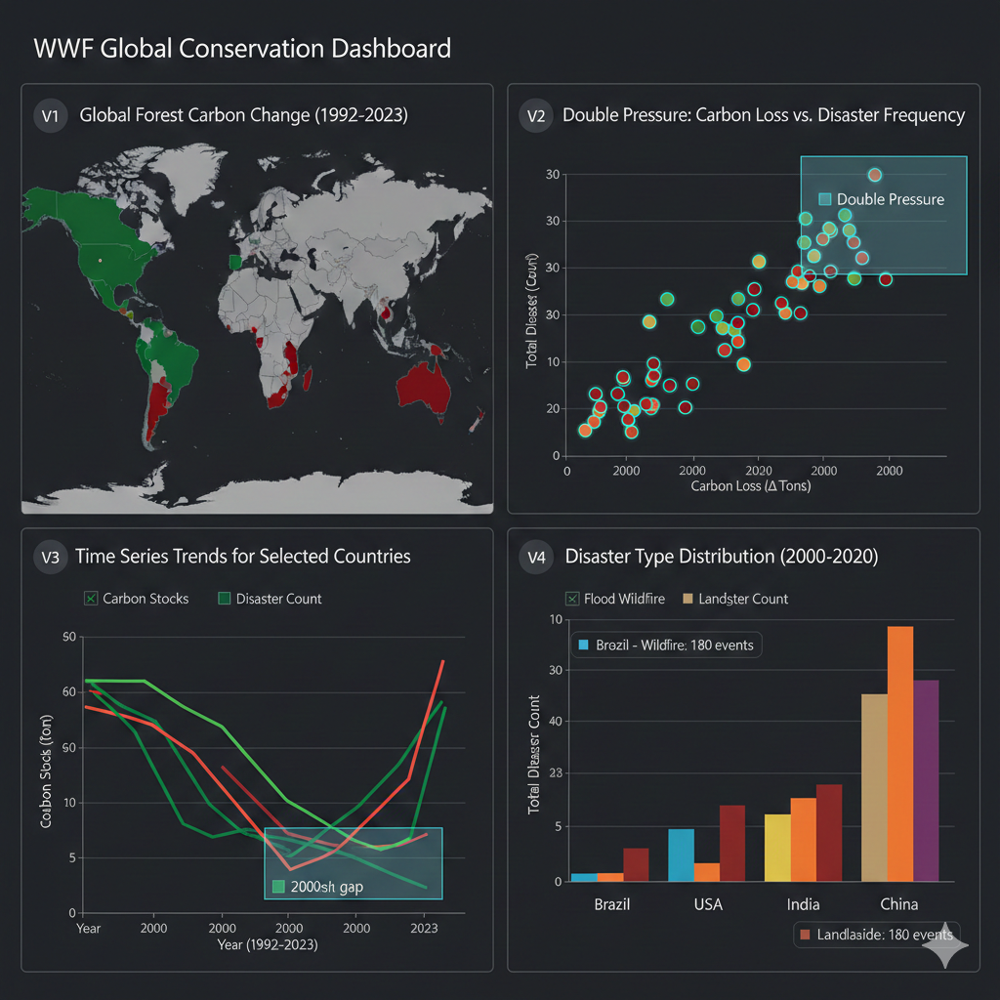

# VIS-Assignment 4 - Report



## 1. Data, users, and tasks (25 points)
```
Please create a detailed description of your users and enrich the information about the 2 distinct users mentioned above and their corresponding tasks (min. 6 tasks total). Give a detailed data description (interesting features, missing values, etc.) and link it to the tasks. To help your users do their jobs, you should verify that your data selection supports the requirements of their tasks. For example, you could load the data into Tableau and inspect the data closely (inspect given features, missing values, etc.).
```


1.1 用户详细描述
我选择了WWF 活动家和Data journalists两个目标用户组

WWF：
制定全球保护战略，目标是识别高风险区域，观察环境变化，灾难统计，确定敢于策略的类型和优先级。
关联分析，栖息地健康 vs 环境压力，追踪长时间序列趋势、定位地理热点和极值

Data journalists
制作数据驱动的新闻报道。 目标是围绕奥地利的核心地位，发现具有新闻价值的故事线（如对比、排名、效率、异常值），以吸引公众。
跨国对比和排名、追踪和比较不同实体的趋势（如奥地利 vs. 欧盟）、识别异常值。


1.2 数据集选择

数据集选择与特征 (Dataset Selection and Characterization)

为支持两组用户共 6 个任务，我们选择了 4 个核心数据集进行分析：

#13 Forest and Carbon： 
包含 Carbon stocks in forests, Forest area 等指标。
这是评估栖息地健康状态的关键指标。
缺失值：1. 时间序列数据（1992-2023年）存在少量缺失值，但整体缺失率极低。 2. 针对 CTS Name 列（100% 缺失值）

#14 Climate-related Disasters Frequency： 
包含 Total Number of Disasters 以及如 Flood, Storm, Drought, Extreme temperature, Landslide, Wildfire 等详细灾害类型。
这是评估环境压力最直接的指标。数据可按灾害类型和年度聚合，但历史早期的记录可能不完整。
缺失值：时间序列的灾难次数缺失代表着灾难在此年为0，即没有发生

#23 Annual Surface Temperature Change： 
包含 Surface Temperature Change。
这是量化气候变化影响的直接指标。数据质量高，时间序列连续性好，适合精确的跨国对比。
缺失值：时间序列连续性好，缺失值较少

#04 CO2Emissions： 
包含 CO2 Emissions 和 CO2 Emissions Intensities 等指标。
CO2 Emissions，用于发现贡献小但受灾重（高影响/低责任）的**“无辜受害者”**新闻主角。
CO2 Emissions Intensities，它作为脱碳效率指标，用于精确对比奥地利与欧盟平均水平，以验证政策成果和经济转型效率。
这是衡量国家对气候变化责任和脱碳效率的关键指标。该数据集明确包含排放强度数据，可以直接支持复杂的经济效率分析。
缺失值：数据完整性好，缺失值较少
注意：每个国家有多个Industry，都有不同的数值，注意后期可能需要聚合多个Industry来代表一个国家的数据


详细任务分析 (Detailed Task Analysis)
A. 用户组 1: WWF 活动家 (WWF Activists)
WWF 的任务集中在**发现（Discover）气候影响与栖息地健康的关联，以及定位（Target）**保护资源的投放优先级。

T1：调查气候变化对世界不同地区自然栖息地的相对影响。调查相关性。 
目的：搞清楚栖息地变差（如森林减少）和气候灾难增多之间是不是有关系，在哪儿关系最密切。
重要性：帮助 WWF 科学地证明气候变化对自然栖息地的具体危害，为制定长期保护计划提供数据基础

T2：识别气候灾害总数最多且森林碳储量减少最快的几个国家/地区。
目的：定位全球面临“双重压力”（高风险、高损失）的热点地区。
重要性：这些极值国家代表了最紧急、最需要资源的保护区，确定哪些国家或地区最紧急、最需要资金和人力投入，确保保护资源用在刀刃上。

T3：分析在某一时间段，所选国家哪种灾难最频发。
目的：明确对比所选热点国家（如 T2 识别出的国家）各自面临的主要灾难威胁类型，以便对每个国家制定针对性的保护和应对策略。
重要性：帮助 WWF 选择正确的干预措施，可以观察出每个国家最严重的气候灾害是什么，例如是侧重于建立洪水屏障，还是侧重于野火预警系统。


B. 用户组 2: 数据记者 (Data Journalists)
数据记者的任务围绕奥地利的核心地位展开，集中在**对比（Compare）和发现（Discover/Target）**新闻叙事。

DJ-T1：演示奥地利年度地表温度变化如何与其地理邻国和欧盟平均水平进行比较。
目的：快速了解奥地利在全球变暖中是热得更快还是更慢，以及和邻居比怎么样。
重要性：建立奥地利气候新闻报道背景，让奥地利公众直观了解气候变化对“我家”和“邻居家”的具体影响

DJ-T2：分析奥地利CO2排放强度在过去 20 年的下降率，并与欧盟平均下降率进行对比。
目的：评估奥地利的经济在发展的同时，减排效率是高还是低，比欧洲平均水平做得好不好。
重要性：对奥地利气候数据验证提供了帮助，对政策是否有用有参考价值

DJ-T3：识别那些温度上升速度快于奥地利但CO2排放总量远低于奥地利的欧洲国家，以构建“无辜受害者”的新闻叙事。
目的：发现那些贡献小但受灾最重的国家，作为新闻故事的**“无辜受害者”**主角。
重要性：这种“高影响/低责任”的异常值分析，是记者生成引人注目的新闻故事和推动全球公平讨论的关键。


## 2. Task abstraction (15 points)
```
Reframe the users' tasks from domain-specific language into an abstract form, using action-target descriptions (see Chapter 3 in Munzner's book or task lecture (link); alternatively, you are welcome to also approach it from the tasks of Heer+Shneiderman, 2012). Each task should have a number assigned so you can easily refer to it in the following sections to argue which visualization supports which task.
```

A. 用户组 1: WWF 活动家 (WWF Activists)

T1	调查不同地区森林面积变化与气候灾害频率之间的相关性。
Analyze (Correlation, Trend): 比较两个属性（森林健康 vs. 灾害频率）随时间变化的趋势。

T2	识别气候灾害总数最多且森林碳储量减少最快的前 5 个国家/地区。
Identify (Rank, Extremes): 找出在两个聚合指标上排名最高的项目（国家）。

T3	分析在某一时间段，展示每个所选国家哪种灾难最频发。
Compare (Distribution): 对比所选目标集合中，每个项目（国家）在特定属性（灾害类型）上的分布构成。


B. 用户组 2: 数据记者 (Data Journalists)

DJ-T1	演示奥地利年度地表温度变化如何与其地理邻国和欧盟平均水平进行比较。
Compare (Contrasting): 对比一个目标项目（奥地利）与其他实体集合（邻国/欧盟）在某一属性上的表现。

DJ-T2	分析奥地利CO2排放强度在过去 20 年的下降率，并与欧盟平均下降率进行对比。
Analyze (Trend, Compare, Rate of Change): 比较两个实体在某一属性变化率上的时间趋势。

DJ-T3	识别那些温度上升速度快于奥地利但CO排放总量远低于奥地利的欧洲国家。
Identify (Rank, Extremes): 找出在两个聚合指标上具有极端对比关系（高影响，低责任）的项目。


## 3. Functionality and usability of the dashboards (10 points each per dashboard = 40 points)
```
Design two dashboards, each one supporting the tasks of the respective user group, with multiple linked visualization components. Please describe and illustrate each view as well as the overall dashboards and describe the interactions between their individual components. For the illustrations, you can use a drawing tool or paper & pencil, which has the advantage that you are only limited by your imagination as to what is possible. Each dashboard must contain at least 4 views, with at least 3 being different visualization types.
For each dashboard, argue why you have chosen a specific visualization for each task at hand (use the numbers from Section 2). Be sure to describe how you will use interactivity and linking between the views. If there is no linking between the views within a dashboard there will be points deducted. Each dashboard will be evaluated based on (a) functionality (how are the tasks implemented in the dashboard?) and (b) usability (how usable is the design with respect to marks & channels, and effectiveness & expressiveness?).
```


设计两个仪表板：

仪表板 A：WWF 活动家仪表板 (Dashboard for WWF Activists)
概览 (V1) → 筛选/排名 (V2) → 详细趋势 (V3) → 构成细节 (V4)

A. 视图设计与任务支持
仪表盘包含4个视图，4种不同的可视化类型（地图、散点图、折线图、饼图）

V1	全球/区域概览地图，(Choropleth Map)
支持任务：T1, T2
有效性 (Effectiveness)地图是表示地理数据的最有效方式。
使用颜色深度通道编码聚合指标（如碳损失率），可以快速利用人类的空间感知能力。

V2	森林与灾害双重指标排名	散点图 (Scatter Plot)
支持任务：T2
表达性 (Expressiveness)利用位置通道识别复合风险最高的极值国家。
X 轴 (Position): 栖息地退化（聚合碳损失量 - 不能简单使用Carbon stocks in forests参数，而是ΔCarbon stocks=期末值−期初值，比如 ΔCarbon stocks = 2000年的碳储量 - 1999的碳储量）
Y 轴 (Position): 灾害总数量（聚合总频率 - Total Number of Disasters
每个散点代表一个国家

V3	时间序列对比图	折线图 (Line Chart)
支持任务：T1, T3
有效性 (Effectiveness)利用位置通道的斜率识别趋势，用于 Analyze 两个指标的相关性。
X 轴 (Position): 时间 / 年份 （Year）。
Y 轴 (Position): 定量指标（Carbon stocks in forests / Total Number of Disasters）。
颜色 (Color): 区分不同的国家/指标
多选框： 有Carbon stock/ Disaster count 两个选项，勾选他们来展示信息，可以只展示一个，也可以展示全部


V4	灾害类型分布	堆叠条形图	
支持任务：T3
有效性 (Effectiveness): 采用堆叠条形图，通过长度通道精确编码每个国家每种灾难的贡献和总次数。这使 WWF 可以对比 (Compare) 热点国家（T2 选出的）。
X 轴 (Position): 国家/地区
Y 轴 (Length): 灾害总次数（聚合总数）。
颜色 (Color): 区分不同的灾害类型（如Flood, Storm）。


B. 核心交互与联动机制 (Linking and Functionality)

V1 (地图)	V2, V3, V4	筛选 (Filtering)
用户通过点击一个或多个国家，立即将分析焦点筛选到特定的国家集合，以进行详细分析。

V2 (散点图)	V1, V3, V4	筛选 (Filtering) / 高亮(Highlighting)
用户通过 Brushing 框选 T2 识别出的高风险热点国家。这些国家将立即在 V3 和 V4 中被筛选，并在 V1 中被高亮，实现属性到细节的快速钻取。

V3 (折线图)	V1, V2, V4	时间刷选 (Time Brushing) / 全局过滤
用户在 V3 上使用Brush拖动选取一个时间段（例如 2010-2020），该时间段将作为全局聚合过滤器。V1、V2 和 V4 中的所有数据将基于此时间段进行重新聚合和展示。这是解决聚合数据（如 V2 散点图的坐标）时间依赖的关键。V3还有两个多选框。有Carbon stock/ Disaster count 两个选项，勾选他们来展示信息，可以只展示一个，也可以展示全部。勾选后只刷新V3的图。


C. 可用性与功能性总结 (Usability and Functionality Summary)
功能性 (Functionality): 仪表板 A 通过 V2（散点图）直接支持 T2 的复合排名，通过 V3（折线图）直接支持 T1 的趋势关联分析，并通过 V4（堆叠条形图）支持 T3 的灾害构成总结。所有任务都能通过直观的筛选和联动操作实现。

可用性 (Usability): 
设计上使用了高表达性和有效性的视觉通道：位置通道 (V2 散点图, V3 折线图) 用于编码定量数据和趋势；长度通道 (V4 堆叠条形图) 用于编码定量数据的构成和总量，确保对 T3 的 Summarize 动作具备高准确性。V3 作为时间控制中心，概览与细节的平衡性良好，通过强大的联动提高了分析效率。


---


仪表板 B：数据记者仪表板 (Dashboard for Data Journalists)
仪表板 B 包含 4 个视图，使用了 4 种不同的可视化类型（地图、分组条形图、折线图、散点图）

V1	欧洲温度变化概览图	着色地图 (Choropleth Map)
支持任务：DJ-T1, DJ-T3
有效性 (Effectiveness)
提供欧洲地理背景，颜色编码温度变化 (ΔT)，快速定位奥地利和邻国的相对“热度” [DJ-T1]。奥地利必须高亮。


V2	跨国 CO₂ 排放强度对比	分组条形图 (Grouped Bar Chart)
支持任务：DJ-T2
有效性 (Effectiveness)比较定量值最准确的视觉编码。将奥地利与欧盟平均值并列，直接支持 Analyze 效率对比 [DJ-T2]
x轴代表国家/实体 (奥地利、欧盟平均值、所选邻国等),通道 类别 (Categorical).
y轴代表CO2排放强度(聚合时间段内的平均值或变化率)，通道 长度 (Length)
条形代表单个国家的 CO2 排放强度值。通道 位置和长度


V3	时间趋势对比	折线图 (Line Chart)
支持任务：DJ-T1, DJ-T2
有效性 (Effectiveness)通过将奥地利线与欧盟平均线放在一起，直接支持 Compare 两个实体的趋势和变化率 [DJ-T1, DJ-T2]。同时作为全局时间控制器
X 轴代表时间 / 年份 (Time / Year)	位置 (Position)
Y 轴代表定量指标数值 (CO2 排放总量 或 ΔT 温度变化)	位置 / 长度
线条代表代表特定实体的趋势线 (如奥地利线、欧盟平均线、邻国线)	位置 (位置变化代表斜率/趋势)
颜色代表区分不同的实体 (如奥地利使用高亮颜色)	颜色


V4	影响 vs. 责任散点图	散点图 (Scatter Plot)
支持任务：DJ-T3
表达性 (Expressiveness)散点图是发现两个定量指标间关系和异常值的最佳选择。
X 轴	气候责任指标 (CO2排放总量，聚合时间段内)	位置
Y 轴	气候影响指标 (地表温度变化总量，聚合时间段内)	位置
圆点 (Mark)	代表欧洲的单个国家。 奥地利必须被高亮。	位置


B. 核心交互与联动机制 (Linking and Functionality)

V1 (地图)	V2, V3, V4	筛选 (Filtering)
通过点击奥地利和其邻国，立即将 V2、V3、V4 的分析范围筛选到记者最关注的区域。

V3 (折线图)	V1, V2, V4	时间刷选 (Time Brushing) / 全局过滤
V3 作为时间轴的主控台。用户刷选的时间段（例如 2000-2020），将作为全局聚合过滤器，立即更新 V1、V2 和 V4 中的聚合计算。

V4 (散点图)	V1, V2, V3	叙事筛选 (Narrative Brushing) / 高亮
记者通过 Brushing 框选特定象限（例如，高 Y, 低 X 的“无辜受害者”国家）。这些国家将立即在 V1 地图上高亮，并在 V2 和 V3 中筛选其数据，以便记者获取详细的趋势和效率数据来支撑叙事。


C. 可用性与功能性总结 (Usability and Functionality Summary)

功能性 (Functionality):
仪表板通过 V3 和 V2 直接支持 DJ-T1 和 DJ-T2（趋势和效率对比）。
V4 的双指标散点图专门支持 DJ-T3，通过框选即可识别极端对比值，实现叙事发现。
V3 的时间刷选功能确保了所有聚合分析（V1, V2, V4）都能基于记者感兴趣的特定时间窗口进行，保证了分析的灵活性和精确性。


可用性 (Usability):
设计上避免了滚动和弹出窗口，所有核心信息一目了然。
使用了最有效的视觉编码：位置通道用于趋势和对比 (V3, V4)，长度通道用于定量比较 (V2)，最大化了数据的有效性 (Effectiveness)。
V4（散点图）的使用具有很高的表达性 (Expressiveness)，它将复杂的双变量关系简化为视觉可辨的模式和离群点，极大地提高了数据记者的工作效率。


## 4. Reflection (15 points)
```
Argue about the pros and cons of each dashboard and the respective visualizations. Here, we are looking for good argumentation about the various designs' strengths and weaknesses concerning the tasks but also concerning the design principles discussed in class:
-What do users get done efficiently and fast with your design?
-How did you balance the most effective visual encodings with the number of attributes in the data?
-Which views are overview views, and which are detail views?
-What tradeoffs in interactions did you make? What limitations are there?
-How does each dashboard link its views?
```


4.1 仪表板 A：WWF 活动家
Pros: 
WWF 用户可以非常高效地完成 T2（识别热点）。V2 散点图使用位置通道编码两个关键聚合指标，是发现复合极值最准确的方式，避免了逐个国家排序的低效。T1 (相关性) 通过 V3 折线图的对比实现，其趋势分析利用了人类对斜率的最佳感知能力。

交互权衡与局限性:
1. 采用了时间刷选 (V3) 来驱动聚合计算。虽然使用聚合可能会损失细节，但支持了对 T2 的“复合风险”的长期定义（例如：定义过去 20 年的复合风险），比只看单一年份更具价值。
2. V2 散点图的坐标是聚合值，如果用户在 V3 中选择的时间段过短，数据可能因缺失值而不够稳定。


视觉编码平衡:
设计平衡了有效性和属性数量：将最关键的定量数据（碳损失率、灾害频率、时间趋势）映射到最有效的位置和长度通道（V2, V3, V4）。V4 采用堆叠条形图而非饼图，牺牲了部分整体感，但换来了长度通道对 T3（灾难构成）的准确比较。

视图角色: 
V1 (地图) 是概览 (Overview) 和地理选择视图。V2 (散点图) 是筛选/热点识别视图。V3 (折线图) 是时间概览和细节视图（时间维度），同时作为全局控制。V4 (堆叠条形图) 是细节 (Detail) 视图，用于构成分析。

视图联动：
高度联动： 采用经典的 Filtering & Brushing 模式。地理选择 (V1/V2) → 筛选数据；时间选择 (V3) → 全局聚合过滤。V3 的时间刷选功能是保持 V1, V2, V4 数据一致性和意义的关键。


4.2 仪表板 B：数据记者
Pros：
高效的叙事发现： 记者可以极快地完成 DJ-T3（识别无辜受害者）。V4 散点图将“影响 vs. 责任”并置，只需通过 Brushing 框选特定的象限，即可立即发现新闻主角。 DJ-T1/DJ-T2 的对比通过 V2/V3 中的奥地利/欧盟高亮设计得到直接支持。

视觉编码平衡：
重点使用最有效的位置和长度编码来支持核心的对比任务。 V4（散点图）的优势是快速识别关系；V2（分组条形图）的优势是精确比较长度（DJ-T2 的效率对比），确保了 DJ 用户对数据的准确性要求。

视图角色：
V1 (地图) 是概览 (Overview)和地理选择。V3 (折线图) 是时间概览、细节对比和全局控制。V2 (条形图) 和 V4 (散点图) 均为细节视图，但 V4 更侧重于发现，V2 更侧重于精确对比。

交互权衡与局限性
权衡： V4 散点图专注于发现异常值，这可能会牺牲数据的地理细节（如，不显示哪个国家是无辜受害者，需要进一步点击）。但通过强大的双向联动（V4 → V1 地图高亮），记者可以迅速找回地理信息。 
局限性： 记者必须主动在 V3 上刷选时间段来定义“聚合”的含义，如果默认时间段不恰当，可能导致误读。

视图联动	
叙事驱动联动： V4 成为叙事过滤器。记者在 V4 上框选发现的“无辜受害者”国家，会立即在 V1 上高亮地理位置，并在 V2/V3 上筛选出它们的效率和趋势数据，形成完整的叙事链（发现 → 定位 → 验证）。


## 5. Conclusion (5 points)
```
Please argue and summarize (based on the design principles and tradeoffs discussed in class and on your reflection above) the most important aspects of your report.
```
两个仪表板都成功地通过多视图联动和高效率的视觉编码（位置、长度）支持了各自的核心任务，并避免了不推荐的交互方式（如滚动、弹窗）。

A (WWF)
分析价值高。 支持复杂的多指标相关性分析 (T1) 和复合风险定位 (T2)。设计挑战在于多个指标的同步对比和聚合逻辑。
理由：
首选实施。 WWF 仪表板的设计在技术实现上更具挑战性，因为它需要精确处理两个不同数据集（森林/灾害）的时间同步和相关性可视化。实现 V3 (折线图) 的双指标趋势分析和 V2 (散点图) 的双指标聚合，能更好地展示 D3.js 和 Vue.js 在复杂数据处理和联动上的能力。


B (记者)
发现效率高。 支持快速的异常值发现 (DJ-T3) 和跨国对比 (DJ-T1)。核心是叙事发现和数据验证。
作为备选。 其设计更依赖于数据的精确比较和高亮。


----


